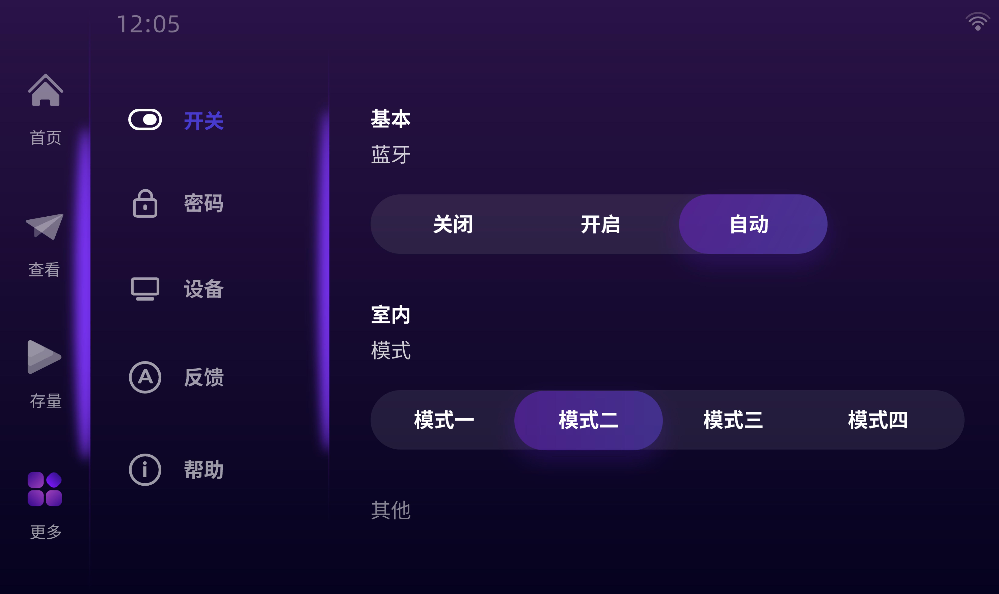

# DustbinWithQT5

智能分类垃圾桶的中位机程序QtQuick5项目，某个被遗忘的版本...

垃圾桶运动演示视频如下：

智能移动垃圾桶.MP4
链接: https://pan.baidu.com/s/1kDwcqjSr_JL7NdfLhq8vvQ?pwd=pw5v 提取码: pw5v 

界面程序演示视频如下：

Qt界面.mp4
链接: https://pan.baidu.com/s/19NntGPKJwPhn-oHyga8ghg?pwd=ghar 提取码: ghar 

**cppUtils**

包含相机线程模块和相机画面渲染到Qt界面的模块
以及一个未完成的Python解释器模块，设计之初是为了在该C++程序中运行Yolo模型，后面发现可以直接用OpenCV重写YOLO前向推理网络

**interface**

串口模块，该程序运行与垃圾桶上层的JetsonNano开发板上，需使用串口与下位机stm32f407zgt6通信，告知其运动信息和垃圾桶仓室选择信息，便于其控制小车底盘运动和旋转分类垃圾桶的电机；

**pages**

使用qml语言绘制的四个页面

**qmlUtils**

使用qml语言编写的自定义图形组件，包含旋转的电池面板、垃圾桶形状的进度条、圆边矩形进度条动画、导航栏动画等

**UI设计稿**

